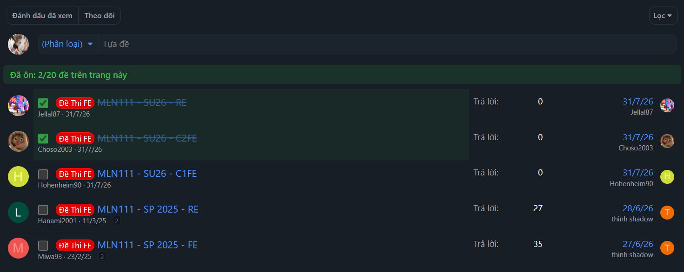
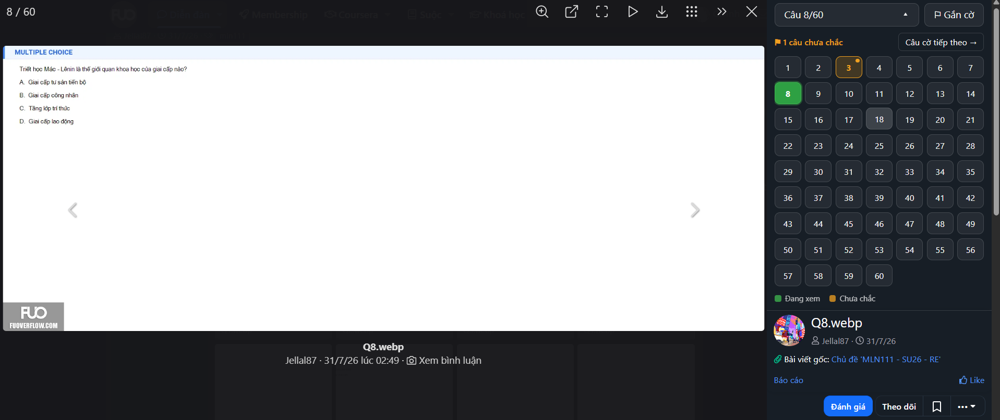

# Extension-Fuoverflow-test-checklist

Extension trình duyệt (Manifest V3) cho diễn đàn [FuOverflow](https://fuoverflow.com), giúp
bạn theo dõi việc ôn đề thi:

- đánh dấu những đề đã ôn xong ngay trên danh sách thread;
- nhảy nhanh tới câu bất kỳ khi xem ảnh đề, và gắn cờ những câu chưa chắc.

## Tính năng

### Checklist đề đã ôn

- Có checkbox đứng trước tiêu đề mỗi thread trong danh sách.
- Thread đã tick sẽ bị gạch ngang và tô nền xanh nhạt.
- Thanh tiến độ hiển thị tổng số đề đã tick và số đề đã tick trên trang hiện tại.
- Trạng thái lưu trong `localStorage` (key `fuo-test-checklist`), theo ID thread, nên vẫn
  giữ nguyên khi phân trang, đổi thứ tự hoặc tải lại trang.

### Nhảy câu và gắn cờ trong lightbox

Khi mở ảnh đề, cột bên phải (phía trên thông tin người đăng) có thêm một panel:

- Nút **"Câu x/N"**: bấm để mở bảng số và nhảy thẳng tới câu bất kỳ. N lấy theo số ảnh của đề.
- Nút **"Gắn cờ"**: đánh dấu câu đang xem là chưa chắc, bấm lại để bỏ cờ.
- Trong bảng số, câu đang xem màu xanh lá, câu có cờ màu cam kèm một chấm nhỏ.
- Nút **"Câu cờ tiếp theo →"**: nhảy qua các câu đã gắn cờ, hết thì quay lại câu đầu.
- Cờ lưu trong `localStorage` (key `fuo-question-flags`), theo ID thread.

## Cài đặt (Brave / Chrome)

1. Mở `brave://extensions` (hoặc `chrome://extensions`).
2. Bật **Developer mode**.
3. Bấm **Load unpacked** và chọn thư mục này.
4. Mở một trang diễn đàn, ví dụ https://fuoverflow.com/forums/MLN111/.

Sau khi sửa code, nhớ bấm nút reload của extension ở trang extensions rồi F5 trang web.

## Lưu ý

- Cần Brave/Chrome từ bản 111 trở lên (script của lightbox chạy với `"world": "MAIN"`).
- Dữ liệu lưu riêng theo từng trình duyệt; tick và gắn cờ ở Brave sẽ không hiện ở Chrome.
- Tổng số đề đã tick tính trên toàn bộ fuoverflow.com, không riêng một môn.
